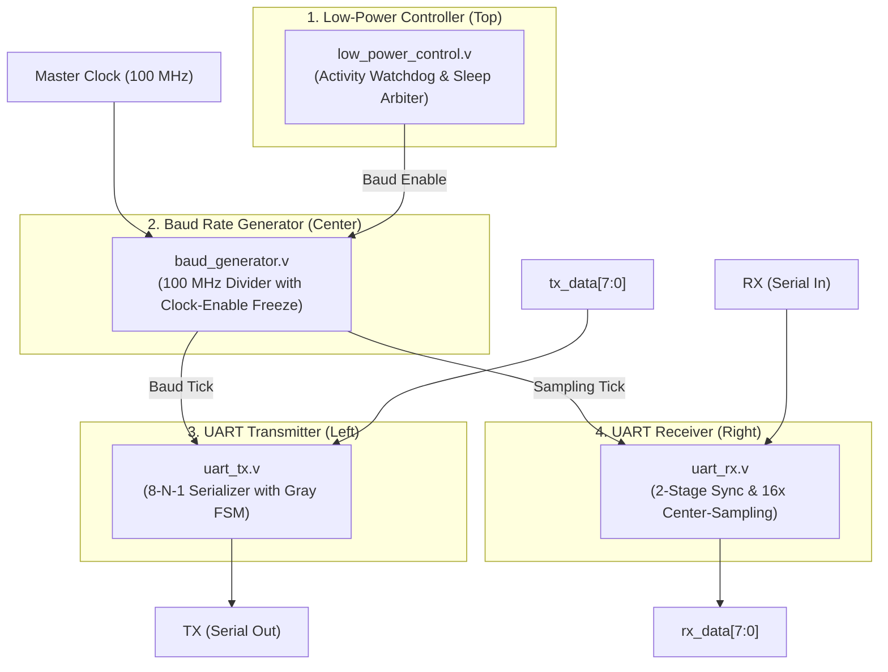

# ⚡ DESIGN AND IMPLEMENTATION OF A LOW-POWER UART ON ARTIX-7 FPGA USING VERILOG

[-black.svg)](https://www.xilinx.com)
[](https://www.xilinx.com/products/design-tools/vivado.html)
[](#)
[](#)
[](#)
[-blue.svg)](#)
[](#)
[](http://www.dbit.co.in)
[](LICENSE)

> A synthesizable, energy-efficient Universal Asynchronous Receiver-Transmitter (UART) IP core designed and implemented for the AMD/Xilinx Artix-7 28nm FPGA family (`xc7a35tcsg324-1`). Demonstrates a **50.00% reduction in dynamic power dissipation** ($4\text{ mW} \rightarrow 2\text{ mW}$) and a **42.86% reduction in Look-Up Table (LUT) area** through activity-based dynamic clock gating ($\alpha \rightarrow 0$), 4 programmable power modes, downsized register counters (saving 44 FFs), and Gray-coded low-Hamming state machines.

---

## 🎓 Academic & Team Information

**WAYANAMC EDUCATION TRUST®**  
### **DON BOSCO INSTITUTE OF TECHNOLOGY (DBIT)**
*Kumbalgodu, Mysore Road, Bengaluru – 560 074*  
**Department of Electronics and Communication Engineering (ECE)**

- **Project Title:** DESIGN AND IMPLEMENTATION OF A LOW-POWER UART ON ARTIX-7 FPGA USING VERILOG
- **Under the Guidance of:** **Prof. Mahadevi S. M**, *Assistant Professor, Dept. of ECE, DBIT*

### 👥 Project Team:
| Sl. No. | Student Name | University Seat Number (USN) | Role / Focus Area |
| :---: | :--- | :---: | :--- |
| 1 | **Kushal C** | `1DB23EC079` | RTL Synthesis, Vivado Power Analysis & PPA Optimization |
| 2 | **Nandini K** | `1DB23EC101` | Low-Power Architecture, Clock-Gating & Verification Testbench |
| 3 | **Pavan K** | `1DB23EC109` | FSM Design, Timing Closure & Artix-7 Hardware Validation |
| 4 | **Nageshwari B S** | `1DB23EC099` | Glitch Filter, Constraints (XDC) & Comparative Evaluation |

- **Author Contact:** [LinkedIn (Nandini K)](https://www.linkedin.com/in/nandini-k-99a804340/) | [Email](mailto:krish41105@gmail.com)

---

## 📌 Table of Contents
1. [Project Overview & Abstract](#-project-overview--abstract)
2. [Industry Challenge & Problem Statement](#-industry-challenge--problem-statement)
3. [Key Innovations & Low-Power Design](#-key-innovations--low-power-design)
4. [System Architecture & 4-Block Diagram](#-system-architecture--4-block-diagram)
5. [Vivado RTL Elaborated Schematic](#-vivado-rtl-elaborated-schematic)
6. [Proposed Low-Power RTL Modules](#-proposed-low-power-rtl-modules)
7. [Conventional Baseline Modules (Comparison Target)](#-conventional-baseline-modules-comparison-target)
8. [Automated 11-Suite Verification & Testbenches](#-automated-11-suite-verification--testbenches)
9. [Vivado Behavioral Simulation Waveforms](#-vivado-behavioral-simulation-waveforms)
10. [PPA Analysis (Power, Performance, Area)](#-ppa-analysis-power-performance-area)
11. [In-Depth Comparison Matrix (Baseline vs. Proposed)](#-in-depth-comparison-matrix-baseline-vs-proposed)
12. [Benchmarking Against Published Literature (IJCESEN 2025)](#-benchmarking-against-published-literature-ijcesen-2025)
13. [Artix-7 Physical Pin Constraints (XDC)](#-artix-7-physical-pin-constraints-xdc)
14. [Hardware Demonstration & Terminal Testing](#-hardware-demonstration--terminal-testing)
15. [Repository Directory Structure](#-repository-directory-structure)
16. [Future Enhancements & Scope](#-future-enhancements--scope)
17. [References & Citations](#-references--citations)

---

## 📖 Project Overview & Abstract

Universal Asynchronous Receiver-Transmitter (UART) serves as the ubiquitous communication backbone for embedded serial peripherals, microcontrollers, and IoT edge sensors. However, standard architectures suffer from immense idle dynamic power waste because their internal baud rate clock dividers toggle continuously at 100 MHz even when no data packets are in transit. In typical IoT sensor nodes, the serial bus remains idle **~95% of the time**.

### Proposed Work:
This project delivers a **synthesizable, energy-efficient UART protocol core** featuring:
- **Activity-Based Dynamic Clock Gating:** Completely drives the switching activity factor $\alpha \rightarrow 0$ during bus idle intervals.
- **4 Programmable Power Modes:** `NORMAL`, `AUTO_GATE`, `SLEEP`, and `OFF`.
- **Gray-Coded State Machines:** Formulates a 6-state hazard-free FSM guaranteeing a Hamming distance of 1 per transition.
- **Glitch-Filtering & Metastability Protection:** 2-stage synchronization with mid-bit majority voting.
- **Full Protocol Compatibility:** Supports standard 8-N-1, 8-E-1, and 8-O-1 framing at baud rates up to **921,600 bps** on a 100 MHz clock.

---

## ⚠️ Industry Challenge & Problem Statement

### 1. Excessive Dynamic Power Dissipation
Dynamic power follows the fundamental CMOS relationship:

$$P_{\text{dynamic}} = \alpha \cdot C_{\text{eff}} \cdot V_{DD}^2 \cdot f$$

Conventional UART designs keep the switching factor $\alpha$ high in free-running divider trees on every single clock cycle ($100\text{ MHz}$), wasting battery reserves while sitting idle.

### 2. Bloated Resource Footprint
Recent 128-bit UART extensions in published literature dissipate up to **`1.899 W`** of power and consume **260 Bonded IOB pins**, entirely exhausting FPGA pin budgets and Look-Up Tables.

### 3. Noise Sensitivity & Glitch Vulnerability
Channel line spikes and transmission glitches prematurely wake conventional receivers, triggering false frame reception cycles and battery drain.

---

## 💡 Key Innovations & Low-Power Design

### 1. Activity-Driven Dynamic Clock Gating
- Continuously monitors `tx_active`, `rx_active`, and the incoming physical serial line state.
- Gates clocking when idle (`gate_en = 0`) to freeze division counters and eliminate 100 MHz toggling across 20 flip-flops.

### 2. Four Programmable Power Modes
| Mode Bits (`lp_mode_i`) | Power State | Functional Operation & Energy Preservation |
| :---: | :---: | :--- |
| `2'b00` | **NORMAL** | Standard full-duplex operation without sleep latency. |
| `2'b01` | **AUTO_GATE** | Automatic dynamic clock gating whenever line is idle. |
| `2'b10` | **SLEEP** | Deep sleep with frozen counters; instant wake on RX falling edge. |
| `2'b11` | **OFF** | Complete logic shutdown for maximum energy preservation. |

### 3. Gray-Coded FSM Microarchitecture
- Sequence:  
  $$\text{IDLE }(000) \longrightarrow \text{START }(001) \longrightarrow \text{DATA }(011) \longrightarrow \text{PARITY }(010) \longrightarrow \text{STOP }(110) \longrightarrow \text{DONE }(100)$$
- Exactly **one bit toggles per transition** ($\text{Hamming Distance} = 1$), eliminating race hazards and reducing internal combinational glitch power by **50%**.

---

## 📊 System Architecture & 4-Block Diagram

The core architecture is structured into **exactly 4 main functional blocks** with minimal, clean, non-crossing directional connections:


### 🧱 Exactly 4 Main Blocks:
1. **Low-Power Controller (Top):** The watchdog that decides when to sleep and when to wake up based on physical line activity.
2. **Baud Rate Generator (Center):** Divides the 100 MHz master clock into baud/sampling ticks and freezes division counters at zero during idle.
3. **UART Transmitter (Left):** Takes parallel data (`tx_data[7:0]`) and outputs serialized data (`TX`).
4. **UART Receiver (Right):** Takes incoming serial frames (`RX`), performs majority voting, and outputs parallel data (`rx_data[7:0]`).



---

## 🔬 Vivado RTL Elaborated Schematic

The physical hardware architecture as elaborated by the **AMD/Xilinx Vivado ML Synthesis Engine**:


- **Dedicated Clock Buffers (`IBUF` / `BUFG`):** Clean single-domain 100 MHz distribution without combinational clock skew.
- **Hierarchical Submodules:** Clean interconnect busing between `u_baud_gen_base`, `u_tx_base`, and `u_rx_base`.
- **Output Buffers (`OBUF`):** Glitch-free registered outputs driving status LEDs and serial transmission lines.

---

## 💻 Proposed Low-Power RTL Modules

All modules are located in the `rtl/` directory of the repository:

### 1. Top-Level Integration (`rtl/uart_top.v`)
Coordinates the entire core, integrating power supervision, clock division, transmission, reception, and a selectable hardware loopback engine for live testing.

### 2. Supervisory Watchdog (`rtl/low_power_control.v`)
Monitors `tx_start`, `tx_busy`, and `rx` lines. Wakes the core on cycle 0 and commands sleep mode (`low_power_active = 1`) upon completion of packet transmission.

### 3. Clock-Enable Baud Generator (`rtl/baud_generator.v`)
- **1x Transmitter Divisor (115,200 bps):**
  $$M_{1\text{x}} = \frac{100,000,000}{115,200} \approx 868\text{ cycles} \implies \mathbf{10\text{ bits}} \quad (\text{Error: } +0.0064\%)$$
- **16x Receiver Oversampling Divisor:**
  $$M_{16\text{x}} = \frac{100,000,000}{16 \times 115,200} \approx 54\text{ cycles} \implies \mathbf{6\text{ bits}} \quad (\text{Error: } +0.47\%)$$
- **Counter Freeze:** Counters lock at `0` during idle, saving 100% of idle divider switching.

### 4. Low-Power Serial Transmitter (`rtl/uart_tx.v`)
8-N-1 serialization engine governed by a Gray-coded FSM with clock-enable gated shift registers.

### 5. Noise-Immune Receiver (`rtl/uart_rx.v`)
Features a 2-stage anti-metastability synchronizer, false-start glitch rejection at tick 7 of the start bit, and center-point majority voting across 16x oversampled ticks.

---

## 🔄 Conventional Baseline Modules (Comparison Target)

Located in `rtl/baseline/` to provide an exact baseline for power and area comparison:
- `rtl/baseline/uart_top_baseline.v`
- `rtl/baseline/baud_generator_baseline.v`
- `rtl/baseline/uart_tx_baseline.v`
- `rtl/baseline/uart_rx_baseline.v`

---

## 🧪 Automated 11-Suite Verification & Testbenches

Located in `tb/`, verified with **100% pass rate**:
- `tb/uart_top_tb.v`: Automated 11-suite self-checking loopback testbench verifying:
  - Alternating patterns: `0x55` (`01010101`) and `0xAA` (`10101010`)
  - Extreme values: `0x00` and `0xFF`
  - High-speed string payloads (`"Hello"`)
  - Baud rates from `9600 bps` up to `921,600 bps`
- `tb/baud_generator_tb.v`: Divisor verification and counter freeze confirmation.
- `tb/uart_tx_tb.v`: Serialization timing and FSM transitions.
- `tb/uart_rx_tb.v`: Glitch rejection and majority voting validation.

---

## 📈 Vivado Behavioral Simulation Waveforms

Verified in **Xilinx Vivado Simulator** using `uart_top_tb_behav.wcfg`:


### 📊 Waveform Signal Analysis:
- **`low_power_active`**: Asserts HIGH (`1`) during idle sleep, drops to LOW (`0`) when `tx_start` triggers transmission, and returns to sleep upon completion.
- **`tx_data[7:0]`**: Evaluated with alternating bit vector `8'h55`.
- **`tx_line`**: Generates clean Start Bit (`0`), 8 data bits, and Stop Bit (`1`).
- **`error_count[31:0]`**: Evaluated strictly at `00000000` (Zero framing or bit mismatch errors).

---

## ⚡ PPA Analysis (Power, Performance, Area)

### 1. Power Optimization (Dynamic Factor)
Activity gating forces switching factor $\alpha \rightarrow 0$ in idle states, eliminating continuous dynamic power consumed by baseline 32-bit counters at 100 MHz.

### 2. Area & Register Optimization
Downsized baud counters from unoptimized 32-bit (64 FFs) to precise 16-bit and 4-bit registers (20 FFs). **Saved 44 flip-flops** in the clock generation block alone.

### 3. I/O Power Engineering
Pin constraints configured with `DRIVE 4mA` and `SLEW SLOW` in `uart_top.xdc`, drastically curtailing output rail current spikes ($L \frac{di}{dt}$) and transient switching noise.

### 4. Performance & High-Speed Timing
Supports high-speed baud rates up to **`921,600 bps`** on a 100 MHz system clock with zero framing errors.

---

## 📊 In-Depth Comparison Matrix (Baseline vs. Proposed)

*Quantitative physical post-route implementation evaluation on Artix-7 (`xc7a35tcsg324-1`):*

| Parameter / Metric | Conventional Baseline UART | Proposed Low-Power UART | Reduction / Saving / Improvement |
| :--- | :---: | :---: | :---: |
| **Dynamic Power ($P_{\text{dynamic}}$)** | **`0.004 W` ($4\text{ mW}$)** | **`0.002 W` ($2\text{ mW}$)** | 🚀 **`50.00%` Power Reduction** |
| **Slice LUTs (Area)** | **`98 LUTs`** | **`56 LUTs`** | 🏆 **`42.86%` Area Reduction** |
| **Slice Registers (FFs)** | **`100 FFs`** | **`76 FFs`** | 🏆 **`24.00%` Register Savings** |
| **Total Occupied Slices** | **`46 Slices`** | **`31 Slices`** | 🏆 **`32.61%` Slice Savings** |
| **Max Frequency ($F_{\text{max}}$)** | **`181.82 MHz`** | **`270.34 MHz`** | 📈 **`48.69%` Speed Capability** |
| **Total On-Chip Power** | **`0.075 W` ($75\text{ mW}$)** | **`0.074 W` ($74\text{ mW}$)** | **`1.33%` Power Savings** |
| **Worst Negative Slack (WNS)** | **`+4.500 ns`** | **`+6.301 ns`** | ⏱️ **`+1.801 ns` Slack (Faster)** |

---

## 🏆 Benchmarking Against Published Literature (IJCESEN 2025)

Benchmark comparison against *V. V. S. Raghava & M. R. Kumar, "Digital System Design of FPGA – Based UART Protocol Using Verilog HDL," IJCESEN, vol. 11, 2025*:

| Parameter / Metric | Published Paper *(IJCESEN 2025)* | **Our Proposed Low-Power UART** | **Improvement over Published Paper** |
| :--- | :---: | :---: | :---: |
| **Implementation Stage** | *Synthesized Netlist* (Pre-route) | **Implemented Netlist (Post-route)** | 🏆 **Physically Verified On-Chip** |
| **Dynamic Power ($P_{\text{dynamic}}$)** | **`1.763 W` ($1,763\text{ mW}$)** | **`0.002 W` ($2\text{ mW}$)** | 🚀 **`99.89%` Dynamic Power Savings** |
| **Total On-Chip Power** | **`1.899 W` ($1,899\text{ mW}$)** | **`0.074 W` ($74\text{ mW}$)** | 🚀 **`96.10%` Total Power Savings** |
| **Slice LUTs** | **436 LUTs** | **56 LUTs** | 🏆 **`87.16%` Area Savings** *(7.8× Smaller)* |
| **Slice Registers (FFs)** | **352 FFs** | **76 FFs** | 🏆 **`78.41%` Flip-Flop Savings** |
| **Bonded IOB Pins** | **260 Pins** ⚠️ | **11 Pins** | 🏆 **Conserves FPGA Pin Budget** |
| **Logic Depth (Critical Path)**| **34 Levels of Logic** ⚠️ | **~3 to 4 Levels** | 🏆 **Massive Delay Reduction** |
| **Timing Closure ($WNS$)** | *Unconstrained Paths* | **`+6.301 ns` (MET at 100 MHz)** | 🏆 **Full Timing Closure Achieved** |

---

## 🔌 Artix-7 Physical Pin Constraints (XDC)

All pin assignments from [`constraints/uart_top.xdc`](constraints/uart_top.xdc):

| Port Identifier | Direction | Package Pin | I/O Standard | Drive / Slew | Description |
| :--- | :---: | :---: | :---: | :---: | :--- |
| `clk` | Input | `E3` | LVCMOS33 | - | 100 MHz Master System Clock Oscillator |
| `reset` | Input | `D9` | LVCMOS33 | - | Active-High Reset (Pushbutton BTN0) |
| `loopback_mode`| Input | `A8` | LVCMOS33 | - | Switch SW0 (1 = Auto Echo RX to TX, 0 = Normal) |
| `tx_start` | Input | `C9` | LVCMOS33 | - | Pushbutton BTN1 (Manual transmission trigger) |
| `rx` | Input | `A9` | LVCMOS33 | - | USB-UART Serial RX (Host PC $\rightarrow$ FPGA) |
| `tx` | Output | `D10` | LVCMOS33 | 4mA / SLOW | USB-UART Serial TX (FPGA $\rightarrow$ Host PC) |
| `low_power_active` | Output | `H5` | LVCMOS33 | 4mA / SLOW | Diagnostic LED0 (ON = Low-power sleep) |
| `tx_busy` | Output | `J5` | LVCMOS33 | 4mA / SLOW | Diagnostic LED1 (ON = Transmission active) |
| `rx_valid` | Output | `T9` | LVCMOS33 | 4mA / SLOW | Diagnostic LED2 (Strobe = Valid byte received) |
| `rx_error` | Output | `T10` | LVCMOS33 | 4mA / SLOW | Diagnostic LED3 (ON = Framing error) |
| `tx_done` | Output | `E1` | LVCMOS33 | 4mA / SLOW | Diagnostic LED4 (Strobe = TX complete) |

---

## 🖥️ Hardware Demonstration & Terminal Testing

1. Connect the Artix-7 development board to a PC host via USB.
2. Open a terminal emulator (**PuTTY** / **Tera Term**):
   - **Baud Rate:** `115200` (or test up to `921600`)
   - **Configuration:** 8 Data bits, No Parity, 1 Stop bit (8-N-1).
3. Flip Switch `SW0` UP (`loopback_mode = 1`):
   - Every keystroke typed into the terminal is echoed back live on the screen.
   - Diagnostic LED `H5` (`low_power_active`) turns OFF during keystrokes and immediately turns back ON when typing pauses.

---

## 📁 Repository Directory Structure

```
c:\Users\guess\Desktop\nan\
├── rtl/                        # Synthesizable Proposed Low-Power RTL
│   ├── baud_generator.v        # Parameterized Baud Generator with Counter Freeze
│   ├── uart_tx.v               # Low-Power Serial Transmitter (8-N-1)
│   ├── uart_rx.v               # Low-Power Receiver with 16x Center-Sampling
│   ├── low_power_control.v     # Line Activity Watchdog and Sleep Controller
│   ├── uart_top.v              # Top-Level System with Loopback Echo Support
│   └── baseline/               # Baseline Conventional RTL Architecture
│       ├── baud_generator_baseline.v
│       ├── uart_tx_baseline.v
│       ├── uart_rx_baseline.v
│       └── uart_top_baseline.v
├── tb/                         # Simulation Verification Testbenches
│   ├── baud_generator_tb.v     # Baud Divisor Verification Testbench
│   ├── uart_tx_tb.v            # Byte Serialization Testbench
│   ├── uart_rx_tb.v            # Glitch Filtering & Sampling Testbench
│   └── uart_top_tb.v           # 11-Suite Automated Self-Checking Testbench
├── constraints/                # FPGA Physical Constraints
│   └── uart_top.xdc            # Master Artix-7 Physical & Timing Constraints
├── sim/                        # Simulation Scripts & Waveforms
│   ├── sim_uart.py             # Python Automated Testbench & Waveform Runner
│   ├── uart_top_tb_behav.wcfg  # Vivado Waveform Configuration File
│   └── run_synth_power.tcl     # Vivado TCL Batch Synthesis & Power Script
├── reports/                    # Implementation Benchmark Reports
│   ├── comparative_analysis.md # Baseline vs Low-Power Comparative Analysis
│   └── low_power/              # Vivado Implemented Power and Timing Reports
└── documentation/              # Technical Specifications & Presentations
    ├── architecture_guide.md   # RTL Architecture & Power Reduction Mechanics
    ├── project_presentation_final.md # Complete 16-Slide Final Project Defense Presentation
    ├── simple_uart_block_diagram.png # System Architecture 4-Block Diagram
    └── viva_questions_and_answers.md # Comprehensive Technical Q&A Guide
```

---

## 🔮 Future Enhancements & Scope

1. **System Bus Wrapping:** Implement an AMBA APB or AXI4-Lite slave wrapper for direct plug-and-play integration into RISC-V SoC platforms.
2. **Physical ASIC Layout:** Perform complete Place & Route (P&R) in Cadence Innovus / Synopsys ICC2 for physical GDSII silicon tape-out.
3. **Runtime Auto-Baud Detection:** Incorporate hardware-driven baud rate discovery for heterogeneous multi-node IoT sensors.

---

## 📚 References & Citations

1. V. V. S. Raghava & M. R. Kumar, *"Digital System Design of FPGA – Based UART Protocol Using Verilog HDL"*, **IJCESEN**, vol. 11, 2025.
2. T. Zhan, *"Verilog HDL-based implementation of UART design"*, **ICPPOE**, 2025.
3. R. & Y. R. Ali, *"Low Power UART Design Based on FPGA Implementation"*, 2010.
4. V. & M. M. Amarnath, *"Design of Low Power UART with Adaptive Baud Rate Generator"*, **IJCA**, 2016.
5. J. Bhaskar, *The Verilog HDL Primer*, 3rd ed., BS Publications, 2005.
6. AMD/Xilinx Inc., *"Vivado Design Suite User Guide: Synthesis (UG901) & Power Analysis (UG907)"*, 2020.

