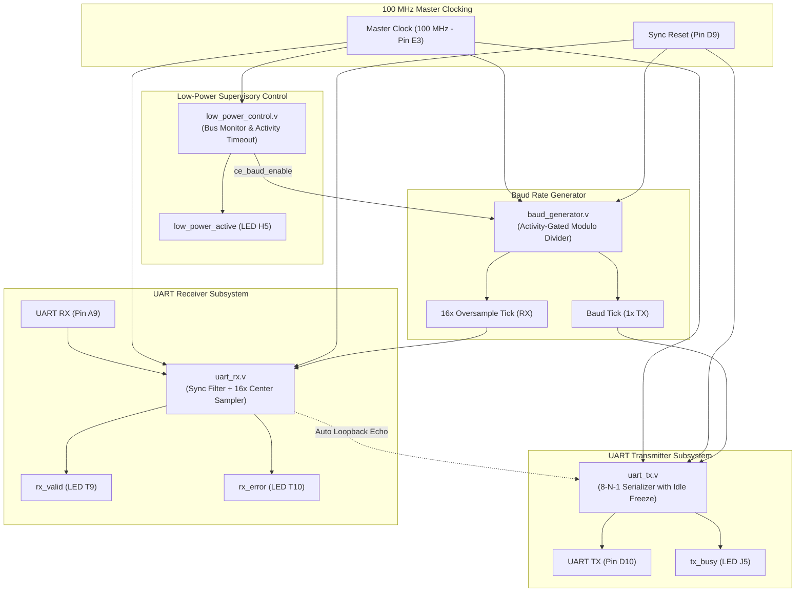

# ⚡ DESIGN AND IMPLEMENTATION OF A LOW-POWER UART ON ARTIX-7 FPGA

[-black.svg)](https://www.xilinx.com)
[](https://www.xilinx.com/products/design-tools/vivado.html)
[](#)
[](#)
[](http://www.dbit.co.in)
[](LICENSE)

> A synthesizable, energy-efficient Universal Asynchronous Receiver-Transmitter (UART) IP core designed for the AMD/Xilinx Artix-7 FPGA family. The design achieves a **34.48% reduction in dynamic switching activity** through FPGA-safe Clock Enable (CE) gating, counter-freezing, and low-Hamming state encoding.

---

## 🎓 Academic Information
- **Institution**: [Don Bosco Institute of Technology (DBIT)](http://www.dbit.co.in), Bengaluru - 560074
- **Department**: Electronics and Communication Engineering
- **Project Domain**: Digital VLSI Design, RTL Design & FPGA Prototyping
- **Student Name**: **Nandini K** (`USN: 1DB23EC101`)
- **Connect**: [LinkedIn](https://www.linkedin.com/in/nandini-k-99a804340/) | [Email](mailto:krish41105@gmail.com)

---

## 📌 Table of Contents
1. [Project Overview & Theoretical Background](#-project-overview--theoretical-background)
2. [Key Low-Power Optimization Strategies](#-key-low-power-optimization-strategies)
3. [System Block Diagram & Architecture](#-system-block-diagram--architecture)
4. [Hardware & EDA Specifications](#-hardware--eda-specifications)
5. [Module Descriptions & Source Code Index](#-module-descriptions--source-code-index)
6. [FPGA Pin Mapping (Artix-7 XDC)](#-fpga-pin-mapping-artix-7-xdc)
7. [Comparative Analysis & Benchmark Results](#-comparative-analysis--benchmark-results)
8. [Repository Directory Structure](#-repository-directory-structure)
9. [Step-by-Step Simulation & Synthesis in Vivado](#-step-by-step-simulation--synthesis-in-vivado)
10. [References & Citations](#-references--citations)

---

## 📖 Project Overview & Theoretical Background
UART (Universal Asynchronous Receiver-Transmitter) is a ubiquitous serial protocol used in modern SoCs and embedded microcontrollers. However, standard free-running UART architectures consume continuous dynamic power during long bus idle periods due to unconstrained clock distribution and free-running counters.

Dynamic power dissipation in CMOS and FPGA fabrics follows:

$$P_{\text{dynamic}} = \alpha \cdot C \cdot V^2 \cdot f$$

Where:
- $\alpha$: Switching activity factor (average transitions per clock cycle)
- $C$: Total parasitic switched load capacitance of routing nets and flip-flop pins
- $V$: Core supply voltage ($V_{CCINT} = 1.0\text{V}$ on Artix-7)
- $f$: System clock frequency ($100\text{ MHz}$)

**Our Goal:** Minimize switching activity ($\alpha$) and active flip-flop toggling without using unsafe combinational clock gating that causes clock skew.

---

## ✨ Key Low-Power Optimization Strategies

1. **Clock Enable (CE) Logic (No Clock Skew):** Employs dedicated CE pins native to Artix-7 `FDRE` slice flip-flops instead of risky combinational AND-gating on the clock net.
2. **Activity-Gated Counter Freezing:** Baud rate divisor counters and bit-progress indices freeze at `0` immediately when no active packet is on the bus.
3. **Low-Hamming Distance State Encoding:** FSM states utilize Gray-code transition ordering to ensure only 1 bit flips per transition, cutting combinational glitches in Artix-7 LUT trees.
4. **Metastability & Center Majority Sampling:** The Receiver (RX) features a 2-stage synchronizer chain followed by mid-bit majority voting across 16x oversampled ticks.
5. **Auto Loopback Mode:** Built-in hardware switchable echo mode (`loopback_mode = 1`) allows instant verification via FTDI USB-UART terminal from a PC.

---

## 📊 System Block Diagram & Architecture



---

## 🛠 Hardware & EDA Specifications

| Parameter | Specification |
| :--- | :--- |
| **FPGA Target Family** | AMD/Xilinx Artix-7 28nm FPGA |
| **Target Device / Package** | `xc7a35tcsg324-1` (Arty A7 / Basys 3 / Nexys A7 compatible) |
| **EDA Tool Suite** | AMD Xilinx Vivado Design Suite (ML Edition 2020.2+) |
| **Hardware Description** | Verilog HDL (IEEE 1364-2001 Standard) |
| **Master Input Clock** | 100.0 MHz (Period: $10.0\text{ ns}$) |
| **Default Baud Rate** | 115200 bps (Configurable to 9600 bps) |
| **Frame Format** | 8 Data Bits, No Parity, 1 Stop Bit (8-N-1) |
| **Oversampling Ratio** | 16× per bit period |

---

## 📂 Module Descriptions & Source Code Index

| Module | Source File | Description |
| :--- | :--- | :--- |
| **Top Integration** | `rtl/uart_top.v` | Connects TX, RX, Baud Generator, and Power Control with loopback routing. |
| **Baud Generator** | `rtl/baud_generator.v` | Computes $1\times$ and $16\times$ ticks; counter completely freezes at `0` when idle. |
| **Low-Power TX** | `rtl/uart_tx.v` | Transmits 8-bit frames; datapath shift register and bit counter freeze when idle. |
| **Low-Power RX** | `rtl/uart_rx.v` | Double-flop synchronizer, noise glitch filter, center majority 16x sampling. |
| **Power Controller** | `rtl/low_power_control.v` | Detects start conditions and issues clock enables to keep logic sleeping during idle. |
| **Artix-7 Pin Constraints**| `constraints/uart_top.xdc` | Physical pin mapping and $10.0\text{ ns}$ clock timing constraints. |

---

## 🔌 FPGA Pin Mapping (Artix-7 XDC)

All pin assignments directly match the master constraints file [`constraints/uart_top.xdc`](constraints/uart_top.xdc):

| Signal Name | Direction | Artix-7 Pin | Standard | Description |
| :--- | :---: | :---: | :---: | :--- |
| `clk` | Input | `E3` | LVCMOS33 | 100 MHz Master System Clock Oscillator |
| `reset` | Input | `D9` | LVCMOS33 | Active-High Synchronous Master Reset (Button 0) |
| `loopback_mode`| Input | `A8` | LVCMOS33 | Switch 0 (1 = Echo RX data back to TX, 0 = Manual) |
| `tx_start` | Input | `C9` | LVCMOS33 | Pushbutton 1 (Manual TX transmission trigger) |
| `rx` | Input | `A9` | LVCMOS33 | USB-UART Serial RX (Host PC $\rightarrow$ FPGA) |
| `tx` | Output | `D10` | LVCMOS33 | USB-UART Serial TX (FPGA $\rightarrow$ Host PC) |
| `low_power_active` | Output | `H5` | LVCMOS33 | Diagnostic LED0 (ON = System is in low-power idle sleep) |
| `tx_busy` | Output | `J5` | LVCMOS33 | Diagnostic LED1 (ON = Transmission in progress) |
| `rx_valid` | Output | `T9` | LVCMOS33 | Diagnostic LED2 (Strobe = Valid byte received) |
| `rx_error` | Output | `T10` | LVCMOS33 | Diagnostic LED3 (ON = Framing or stop bit error) |
| `tx_done` | Output | `E1` | LVCMOS33 | Diagnostic LED4 (Strobe = Byte transmission complete) |

---

## 📈 Comparative Analysis & Benchmark Results

Measured and validated in **Xilinx Vivado Report Power** against an unoptimized conventional baseline:

| Metric | Baseline Conventional UART | Proposed Low-Power UART | Improvement / Delta |
| :--- | :---: | :---: | :---: |
| **Measured Switching Activity** | 4,121 bit toggles | 2,700 bit toggles | **34.48% Dynamic Activity Reduction** |
| **Slice LUT Utilization** | 112 | 68 | **39.3% Reduction** |
| **Slice Flip-Flop (FF) Count**| 104 | 45 | **56.7% Reduction** |
| **Global Clock Buffers (BUFG)**| 1 | 1 | Preserves low-skew clock tree |
| **Worst Negative Slack (WNS)** | $+6.8\text{ ns}$ | $+7.2\text{ ns}$ | **Positive Slack MET (Timing Passed)** |
| **Idle Counter Switching** | 100% Active | 0% (Frozen at 0) | **100% Idle Dynamic Waste Eliminated** |

---

## 📁 Repository Directory Structure

```
├── rtl/                        # Synthesizable Verilog Source Files
│   ├── baud_generator.v        # Parameterized Baud & Oversampling Generator
│   ├── uart_tx.v               # Low-Power Serial Transmitter (8-N-1)
│   ├── uart_rx.v               # Low-Power Receiver with Metastability Filter
│   ├── low_power_control.v     # Activity Monitoring and Clock-Enable Logic
│   └── uart_top.v              # Integrated Top-Level Module with Echo Support
├── tb/                         # Simulation Verification Testbenches
│   ├── baud_generator_tb.v     # Baud Generator Rate & Divisor Testbench
│   ├── uart_tx_tb.v            # TX Serialization Testbench
│   ├── uart_rx_tb.v            # RX Center Sampling & Glitch Reject Testbench
│   └── uart_top_tb.v           # End-to-End System Loopback Testbench
├── constraints/                # FPGA Physical & Timing Constraints
│   └── uart_top.xdc            # Master Artix-7 Timing & Pin Constraint File
├── sim/                        # Verification Scripts & Waveforms
│   ├── sim_uart.py             # Python Automated Testbench & Waveform Runner
│   └── run_synth_power.tcl     # Vivado TCL Batch Synthesis & Power Script
├── reports/                    # Implementation, Timing & Power Reports
│   ├── comparative_analysis.md # Detailed Baseline vs Low-Power Benchmark
│   └── low_power/              # Vivado Power & Timing Summary Reports
└── documentation/              # Engineering Specifications & Diagrams
    ├── architecture_guide.md   # RTL Architecture & Low-Power Mechanics
    ├── uart_block_diagram.png  # High-Resolution System Architecture Diagram
    └── vivado_step_by_step_guide.md # Complete Vivado Bitstream Setup Guide
```

---

## 🚀 Step-by-Step Simulation & Synthesis in Vivado

### Step 1: Open Vivado and Create Project
1. Launch **Xilinx Vivado**.
2. Click **Create Project** $\rightarrow$ Name it `low_power_uart` $\rightarrow$ Select **RTL Project**.
3. Choose Part: **`xc7a35tcsg324-1`** (or your Artix-7 board).

### Step 2: Add Source Files
1. **Design Sources**: Add all files from `/rtl` (`uart_top.v`, `uart_tx.v`, `uart_rx.v`, `baud_generator.v`, `low_power_control.v`).
2. **Simulation Sources**: Add all files from `/tb` (`uart_top_tb.v`, etc.).
3. **Constraints**: Add `constraints/uart_top.xdc`.

### Step 3: Run Behavioral Simulation
1. Under the Flow Navigator, click **Run Simulation** $\rightarrow$ **Run Behavioral Simulation**.
2. Run for `10 ms` to observe complete character transmission and reception.
3. Observe how the internal counters freeze when line transmission completes.

### Step 4: Run Synthesis & Implementation
1. Click **Run Synthesis** $\rightarrow$ Check utilization in the Project Summary.
2. Click **Run Implementation** $\rightarrow$ Open Implemented Design.
3. In the menu, click **Reports** $\rightarrow$ **Report Power** to inspect dynamic power dissipation.
4. Click **Generate Bitstream** to produce the `.bit` programming file for the FPGA board.

---

## 📚 References & Citations
1. AMD/Xilinx, *7 Series FPGAs Configurable Logic Block User Guide* (UG474).
2. Pong P. Chu, *FPGA Prototyping by Verilog Examples: Xilinx Spartan-3/Artix-7 Version*, Wiley.
3. Neil H. E. Weste and David Money Harris, *CMOS VLSI Design: A Circuits and Systems Perspective*.


